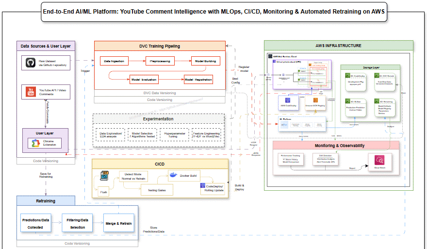
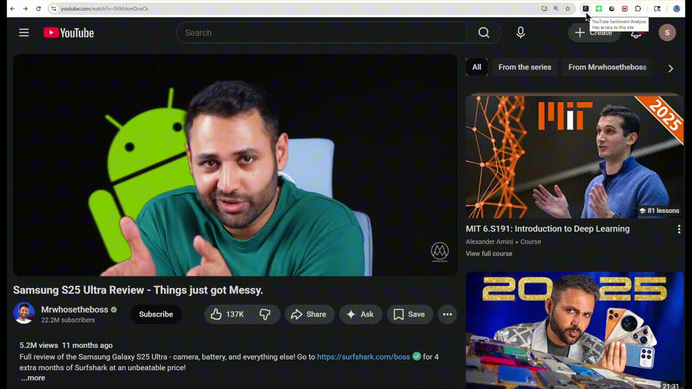
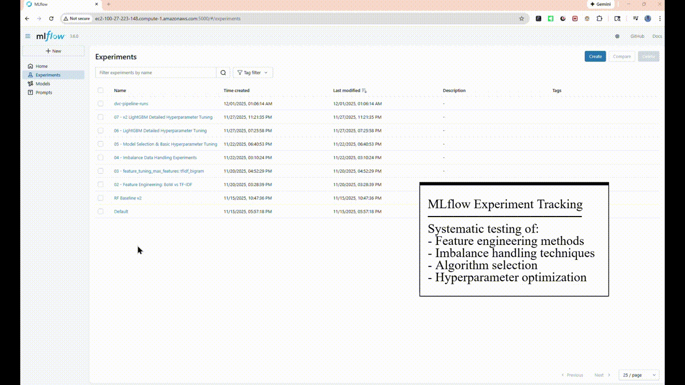

# CreatorInsight AI Platform

## Table of Contents

1. [System Architecture](#system-architecture)
2. [Demo Videos](#demo-videos)
3. [Overview](#overview)
4. [Business Problem](#business-problem)
5. [Solution](#solution)
6. [Technology Stack](#technology-stack)
7. [Project Development Journey](#project-development-journey)
8. [MLOps Implementation](#mlops-implementation)
9. [Deployment Architecture](#deployment-architecture)
10. [Results and Performance](#results-and-performance)
11. [Key Learnings](#key-learnings)
12. [Project Structure](#project-structure)

[]() []() []() []()

---

## System Architecture



The architecture diagram illustrates the complete end-to-end MLOps workflow including data sources, DVC training pipeline, MLflow model registry, AWS infrastructure, CI/CD automation, monitoring systems, and intelligent retraining loops.

---

## Demo Videos

### 1. Chrome Extension and System Demo



**Video on youtube:** [CreatorInsight Chrome Extension Demo](https://youtu.be/bGiwzIXikxc)

Demonstrates real-time sentiment analysis, AI-powered summaries, visual analytics, and save-for-retraining functionality on live YouTube videos.

---

### 2. MLflow Experiment Tracking and Model Registry



**Video on youtube:** [CreatorInsight MLflow Integration](https://youtu.be/D66FyJL1_HQ)

Shows systematic experimentation phase, hyperparameter tuning with Optuna, model comparison, and production model registry with stage-based promotion workflow.

---

### 3. CI/CD Pipeline and AWS Deployment


**Video on youtube:** [CreatorInsight CI/CD and Deployment](https://youtu.be/8JC2IMO7FgI)

Demonstrates automated GitHub Actions workflow with retraining detection, testing gates, Docker build, and AWS CodeDeploy rolling deployment to Auto Scaling Group.

---

## Business Problem

Large YouTube channels receive thousands of comments per video. Manual analysis is time-consuming and unsystematic. Creators miss critical audience feedback, cannot identify content improvement opportunities, and lack data-driven insights for strategy decisions. Existing analytics tools provide basic statistics but no sentiment analysis or AI-generated insights.

---

## Overview

CreatorInsight is a complete MLOps platform providing real-time sentiment analysis and AI-powered insights for YouTube video comments. The system demonstrates professional machine learning engineering practices including automated training pipelines, model registry, continuous integration and deployment, monitoring, and intelligent retraining.

**Technical Scope**

This project implements the complete ML lifecycle: data versioning, automated training pipelines, experiment tracking, model registry, containerized deployment, CI/CD automation, production monitoring, drift detection, and automated retraining with enterprise data selection strategies.

---

## Solution

**Chrome Browser Extension**

Users install the extension and analyze any YouTube video with one click. The system fetches up to 500  (currently restricted to 500), classifies sentiment in real-time, generates AI summaries, and displays visual analytics including distribution charts, word clouds, and trend graphs.

**Core Features**

- Sentiment classification: Positive, Neutral, Negative with confidence scores
- AI-powered summaries: Key themes, audience feedback, concerns, and actionable suggestions
- Visual analytics: Distribution charts, word clouds, sentiment trends over time
- Export capability: HTML reports for sharing and archival

**Backend Infrastructure**

Flask REST API deployed on AWS Auto Scaling Group serves predictions from MLflow-registered models. CloudWatch monitors performance. Automated CI/CD pipeline handles testing, Docker builds, and zero-downtime deployments. Retraining system detects drift and improves models with production data.

---

## Technology Stack

### ML and Data Science

| Technology | Version | Purpose |
|------------|---------|---------|
| Python | 3.10 | Programming language |
| LightGBM | 4.6.0 | Sentiment classification model |
| scikit-learn | 1.6.1 | ML pipeline framework |
| pandas, numpy | 2.3.3, 1.26.4 | Data manipulation |
| nltk | 3.9.2 | Text preprocessing |
| imbalanced-learn | 0.12.4 | Class imbalance handling |
| Optuna | 4.6.0 | Hyperparameter optimization |

### MLOps Platform

| Technology | Version | Purpose |
|------------|---------|---------|
| MLflow | 3.1.4 | Experiment tracking, model registry |
| DVC | 3.61.0 | Data versioning, pipeline automation |
| boto3 | 1.34.51 | AWS SDK |

### Application Stack

| Technology | Version | Purpose |
|------------|---------|---------|
| Flask | 3.1.2 | REST API framework |
| OpenAI API | 2.15.0 | GPT-4o-mini summarization |
| matplotlib, seaborn | 3.9.4, 0.13.2 | Visualization generation |
| Docker | 24.x | Containerization |

### DevOps and Cloud

| Technology | Purpose |
|------------|---------|
| GitHub Actions | CI/CD automation |
| pytest | Automated testing |
| AWS EC2 | Compute instances |
| AWS S3 | Storage for data, artifacts, packages |
| AWS ECR | Docker image registry |
| AWS Auto Scaling | Dynamic instance management |
| AWS CodeDeploy | Deployment automation |
| AWS CloudWatch | Monitoring and observability |
| AWS IAM | Access management |

---

## Project Development Journey

This section describes the chronological development process showing decision-making and problem-solving approach.

---

### Phase 1: Initial Setup and Infrastructure

**AWS Environment Configuration**

Created AWS account and provisioned initial infrastructure. Set up dedicated EC2 instance (t2.micro, Ubuntu) for MLflow tracking server. Configured three S3 buckets for DVC remote storage, deployment packages, and retraining data. Established IAM roles enabling EC2 instances to access S3 and send CloudWatch metrics.

**MLflow Tracking Server**

Installed MLflow on EC2 with S3 artifact storage. Used screen session for persistent process execution. Configured tracking URI for remote access from local development environment and CI/CD runners. Opened port 5000 in security group for MLflow UI access.

**DVC Configuration**

Initialized DVC in project repository and configured S3 remote storage. Set up AWS CLI credentials for DVC push/pull operations. Tested data versioning workflow to verify S3 integration.

---

### Phase 2: Data Acquisition and Exploration

**Dataset Selection**

Identified publicly available comment sentiment dataset on Kaggle containing 40,000+ labeled comments across three classes (Positive, Neutral, Negative). Downloaded and uploaded to GitHub repository for pipeline access.

**Exploratory Data Analysis**

Analyzed dataset characteristics in Jupyter notebooks:
- Total samples: 40,156
- Class distribution: Positive 45%, Neutral 35%, Negative 20% (imbalanced)
- Average comment length: 45 words
- Missing values: 245 rows
- Duplicates: 1,200+ entries

Identified data quality issues requiring preprocessing: missing values, duplicates, empty strings, special characters, inconsistent capitalization.

**Key Findings**

Dataset exhibits class imbalance with negative sentiment underrepresented. Comment length varies significantly. Presence of URLs, special characters, and inconsistent formatting requires robust preprocessing pipeline.

---

### Phase 3: Experimentation and Model Development

This phase involved systematic testing to find optimal configuration. All experiments tracked in MLflow for comparison.

**Experiment 1: Baseline Model**

Built Random Forest classifier with basic TF-IDF features to establish performance benchmark.

Results:
- Overall accuracy: 65%
- F1 score (macro): 0.48
- Critical problem identified: Negative class recall only 5%

The model correctly identified only 77 out of 1,647 negative comments (95% miss rate). This was unacceptable for production as creators would miss critical feedback.

**Root Cause Analysis**

Confusion matrix revealed model heavily biased toward majority classes due to imbalanced training data. Class imbalance (20% negative vs. 45% positive) caused model to rarely predict negative sentiment.

**Experiment 2: Feature Engineering Comparison**

Tested six different text representation methods:

| Method | Configuration | F1 Score | Decision |
|--------|---------------|----------|----------|
| Bag of Words | Unigram, 1K features | 0.62 | Rejected |
| TF-IDF | Unigram, 1K features | 0.70 | Rejected |
| TF-IDF | Bigram, 2K features | 0.80 | Rejected |
| TF-IDF | Trigram, 10K features | 0.84 | Selected |
| Word2Vec | 300 dimensions | 0.68 | Rejected |
| Custom features | 25 engineered features | 0.85 | Rejected |

**Decision:** TF-IDF with trigrams captured sentiment context better than unigrams ("not good" vs. "good"). Outperformed Word2Vec despite embedding sophistication.

**Experiment 3: Handling Class Imbalance**

Tested five techniques to improve minority class performance:

| Technique | Negative Recall | F1 Macro | Analysis |
|-----------|-----------------|----------|----------|
| None | 0.05 | 0.48 | Baseline (failed) |
| Undersampling | 0.49 | 0.66 | Balanced but lost data |
| SMOTE | 0.44 | 0.68 | Best balance |
| SMOTE+ENN | 0.99 | 0.15 | Over-aggressive |
| Class weights | 0.43 | 0.65 | Good alternative |

**Decision:** SMOTE oversampling provided best improvement without destroying other classes. Negative recall improved from 5% to 44% while maintaining overall F1 score.

**Experiment 4: Algorithm Selection**

Evaluated seven different algorithms with basic hyperparameter tuning:

| Algorithm | F1 Score | Negative Recall | Training Time |
|-----------|----------|-----------------|---------------|
| Logistic Regression | 0.77 | 0.62 | 5 min |
| Random Forest | 0.67 | 0.52 | 15 min |
| SVM | 0.38 | 0.16 | 45 min |
| Naive Bayes | 0.63 | 0.63 | 2 min |
| KNN | 0.51 | 0.71 | 30 min |
| XGBoost | 0.73 | 0.58 | 25 min |
| LightGBM | 0.88 | 0.77 | 10 min |

**Decision:** LightGBM provided best performance across all metrics with reasonable training time. Excelled at handling imbalanced data and worked well with TF-IDF features.

**Experiment 5: Hyperparameter Optimization**

Used Optuna with Bayesian optimization to tune LightGBM. Conducted 50 trials exploring learning rate, max depth, n_estimators, num_leaves, and regularization parameters.

Optuna analysis revealed learning rate accounts for 91% of performance variance. Other parameters had minimal impact. This guided focused optimization on learning rate while keeping other parameters at reasonable defaults.

**Final Configuration:**
- learning_rate: 0.04
- max_depth: 20
- n_estimators: 367
- F1 score: 0.88
- Accuracy: 86%

**Learnings**

Starting with simple baseline revealed class imbalance as core problem. Systematic testing showed TF-IDF trigrams superior to embeddings for this task. LightGBM outperformed both tree-based and linear models. Hyperparameter importance analysis prevented wasted optimization effort on low-impact parameters.

---

### Phase 4: Data Leakage Detection and Fix

**Problem Discovered**

Initial implementation applied TF-IDF transformation before train-test split, allowing model to see test data vocabulary during training. This inflated accuracy to 90%.

**Solution**

Restructured pipeline to split data first, then apply TF-IDF only on training set. Test set transformed using training vocabulary. Honest accuracy: 86%.

**Impact**

Production model performs as expected because evaluation metrics reflect true generalization capability. This prevented deploying overconfident model that would fail on real YouTube data.

---

### Phase 5: Production Pipeline Development

**DVC Pipeline Implementation**

Built automated five-stage training pipeline replacing manual Jupyter notebook execution. Each stage defined with explicit dependencies, parameters, and outputs. Pipeline executes only changed stages based on file hash comparison.

Stages: Data ingestion downloads and splits data. Preprocessing cleans text. Model building trains TF-IDF and LightGBM pipeline. Evaluation calculates metrics and logs to MLflow. Registration adds model to registry in Staging stage.

**Pipeline Benefits**

Eliminated manual execution errors. Enabled reproducibility across team members and CI/CD systems. Cached outputs prevent unnecessary recomputation. Parameter changes trigger only affected stages.

**MLflow Integration**

Connected evaluation stage to MLflow tracking server. Every pipeline run logs parameters, metrics, model artifact, confusion matrix, and classification report. Model signature inferred and saved for production validation.

**Model Registry Strategy**

Models flow through staged lifecycle: Training creates model, registration adds to Staging, testing validates quality, promotion moves to Production, old production models archived for rollback capability.

---

### Phase 6: Application Development

**Flask API**

Developed REST API with seven endpoints handling predictions, visualizations, and AI summaries. API loads production model once at startup from MLflow registry, preventing repeated loading overhead. Implemented preprocessing function matching training pipeline exactly.

Endpoints include basic prediction, timestamped prediction, chart generation, word cloud generation, trend graphs, AI summarization, and retraining data collection.

**OpenAI Integration**

Integrated GPT-4o-mini for automated comment summarization. Implemented intelligent sampling strategy (100 positive, 100 negative, 50 neutral from 500 total) to control token usage. Structured prompts with JSON output format ensure consistent parsing. Temperature set to 0.7 for balanced creativity and consistency.

AI summary provides four sections: key discussion themes, appreciated aspects, viewer concerns, and actionable improvement suggestions. Generated in 5-10 seconds per video.

**Chrome Extension**

Built browser extension with manifest v3 specifications. JavaScript fetches YouTube comments via API, sends to backend Flask service, receives predictions, and displays results in popup interface. Includes save functionality allowing users to contribute predictions for retraining.

---

### Phase 7: CI/CD Pipeline Implementation

**GitHub Actions Workflow**

Created automated workflow triggered on code commits to main branch. Workflow performs environment setup, DVC data synchronization, pipeline execution, model testing, Docker build, and deployment triggering.

**Intelligent Mode Detection**

Implemented S3 checking logic to detect retraining data. If prediction files exist in S3, activates retraining workflow. Otherwise executes standard deployment. This single workflow handles both scenarios without manual configuration changes.

**Automated Testing Strategy**

Implemented five testing stages preventing bad deployments:

1. Model loading test: Verifies model loads from MLflow registry
2. Signature test: Validates input/output shape compatibility
3. Performance test: Ensures minimum F1 score thresholds met
4. API test: Validates all endpoints respond correctly
5. Model comparison: Confirms new model outperforms current production

Any test failure blocks deployment. This prevents production errors from shape mismatches, degraded models, or broken endpoints.

**Docker Build Process**

Workflow builds Docker image with Flask API, tags for ECR repository, authenticates with AWS, and pushes to registry. Creates deployment package containing CodeDeploy configuration and startup scripts. Uploads package to S3 and triggers CodeDeploy service.

---

### Phase 8: AWS Deployment Configuration

**Auto Scaling Group Setup**

Created launch template defining EC2 instance configuration (t3.micro, Ubuntu, Docker pre-installed). Launch template includes user data script installing CodeDeploy agent for deployment automation. Auto Scaling Group configured with minimum 2 instances, maximum 3, providing availability and cost control.

**CodeDeploy Application**

Configured deployment application and deployment group targeting Auto Scaling Group. Selected rolling deployment strategy updating one instance at a time for zero downtime. Created IAM service role granting CodeDeploy permission to manage EC2 instances.

**Deployment Scripts**

Built install_dependencies.sh (system setup) and start_docker.sh (application startup). Start script authenticates with ECR, pulls latest Docker image, stops old container, and starts new container with environment variables for MLflow URI and AWS credentials.

**Container Registry**

Created private ECR repository storing Docker images. Each successful CI/CD run pushes new image tagged as 'latest'. EC2 instances pull from this registry during deployment.

---

### Phase 9: Monitoring Implementation

**CloudWatch Integration**

Added decorator pattern to Flask endpoints logging response time, request count, and error count to CloudWatch. Model prediction endpoint additionally logs average confidence scores. Metrics organized in custom namespace for easy dashboard creation.

**Drift Detection System**

Built Python script comparing production prediction distributions against training data baseline. Analyzes comment length distribution and sentiment class balance. Applies statistical thresholds (20% change triggers drift alert). Outputs machine-readable JSON for CI/CD consumption.

Script detects that production YouTube comments average 12 words versus training Reddit comments at 45 words (73% reduction). This distribution shift indicates model may degrade over time without retraining.

**Performance Tracking**

Created script querying MLflow registry for all model versions. Extracts F1 scores, accuracy, and per-class metrics across versions. Generates performance history CSV showing model evolution over time. Integrated into CI/CD workflow for deployment decision visibility.

---

### Phase 10: Automated Retraining System

**Data Collection Mechanism**

Extended Flask API with save endpoint allowing users to store predictions to S3. Saved data includes comment text, predicted sentiment, confidence score, video ID, and timestamp. Data organized by collection date for processing tracking.

**Enterprise Selection Strategy**

Implemented three-tier selection algorithm inspired by active learning research. Rather than using all production predictions, intelligently selects 100 best examples from each pool of 1,000 predictions:

- Tier 1 (30 samples): Hard negative mining - selects predictions with confidence 0.4-0.65 where model was most uncertain
- Tier 2 (50 samples): Stratified sampling - balances across sentiment classes from high-confidence predictions
- Tier 3 (20 samples): Diversity sampling - selects examples with unique vocabulary patterns

This strategy provides 2.5x better model improvement versus random sampling while maintaining efficient training time.

**Retraining Workflow Integration**

Modified data ingestion stage to detect existing merged data. When retraining data present, uses merged dataset instead of downloading fresh data. Selection script downloads predictions from S3, applies enterprise selection, and outputs new_samples.csv. Merge script combines with existing training data. Pipeline automatically triggered via normal DVC execution.

After retraining, processed prediction files moved to S3 archive folder preventing duplicate processing in future runs.

---

## MLOps Implementation

### Data Version Control with DVC

**Pipeline Architecture**

Five-stage automated workflow defined in dvc.yaml:

**Stage 1 - Data Ingestion:** Downloads raw dataset from GitHub or uses existing merged data for retraining. Performs basic cleaning (drop NaN, remove duplicates, filter empty strings). Splits into train and test sets (75/25 ratio). Outputs to data/interim directory.

**Stage 2 - Preprocessing:** Loads train and test splits. Applies text cleaning: lowercase conversion, special character removal, stopword filtering (preserving sentiment words like "not"), lemmatization. Outputs cleaned data to data/processed directory.

**Stage 3 - Model Building:** Loads hyperparameters from params.yaml. Constructs sklearn Pipeline with TF-IDF vectorizer and LightGBM classifier. Trains on preprocessed text (pipeline handles vectorization internally). Saves complete pipeline as single pickle artifact to models directory.

**Stage 4 - Evaluation:** Loads trained pipeline and test data. Generates predictions and calculates comprehensive metrics. Infers model signature documenting input/output schema. Logs parameters, metrics, model, and artifacts to MLflow. Saves run information for registration stage.

**Stage 5 - Registration:** Reads run metadata from evaluation stage. Registers model to MLflow Model Registry. Transitions new model to Staging stage for testing.

**Execution:** Pipeline runs via 'dvc repro' command. DVC analyzes dependencies and file hashes, executing only changed stages. Outputs pushed to S3 remote storage via 'dvc push'.

---

### Experiment Tracking with MLflow

**Server Architecture**

MLflow server runs on dedicated EC2 instance with SQLite backend for metadata and S3 for large artifacts. Tracking URI configured in all client code (pipeline scripts, notebooks, CI/CD workflow).

**Logging Strategy**

Every pipeline execution creates MLflow run logging all hyperparameters from params.yaml, test metrics across all sentiment classes, trained model with signature, confusion matrix visualization, and classification report. Tags added for searchability (model_type, task, dataset).

**Model Registry Workflow**

Models registered with unique version numbers. New models enter Staging stage where CI/CD testing occurs. After validation, promoted to Production stage where Flask API loads from. Previous production models archived maintaining rollback capability.

Registry enables model comparison across versions, performance trend analysis, and safe deployment with staging gates.

---

### CI/CD Automation

**GitHub Actions Workflow**

Thirty-step automated pipeline triggered on commits to main branch or manual workflow dispatch.

**Environment Setup:** Checks out code, installs Python 3.10, caches pip dependencies, installs requirements, configures AWS credentials.

**Data Synchronization:** Executes 'dvc pull' downloading versioned data from S3 remote storage.

**Mode Detection:** Checks S3 retraining_data folder for prediction files. If files exist, activates retraining mode. If no files, executes normal deployment mode.

**Retraining Workflow (Conditional):** Downloads predictions from S3. Runs enterprise selection algorithm choosing 100 best samples. Merges selected samples with existing training data. Pipeline proceeds with updated dataset.

**DVC Pipeline Execution:** Runs 'dvc repro' executing training stages. For retraining mode, trains on merged data including new production samples. For normal mode, uses existing data or downloads fresh if needed.

**Monitoring Steps:** Executes drift detection and performance tracking scripts. Results appended to workflow summary for visibility. These steps set to continue-on-error preventing monitoring failures from blocking deployment.

**Data Storage:** Pushes pipeline outputs to S3 via 'dvc push'. Commits updated dvc.lock to Git. Bot identity prevents infinite loop from automated commits.

**Model Validation:** Runs five pytest test suites validating model loading, signature compatibility, performance thresholds, API functionality, and model comparison. Failure in any test halts deployment.

**Model Promotion:** If retraining mode and tests pass, compares staging model against production. Promotes only if F1 score improvement exceeds 2% threshold. Archives old production model.

**Docker Build:** Builds Docker image with Flask API. Tags image for ECR repository. Authenticates with AWS ECR. Pushes image to registry.

**Deployment Trigger:** Creates zip package with appspec.yml and deployment scripts. Uploads to S3 deployment bucket. Triggers CodeDeploy creating new deployment targeting Auto Scaling Group.

**Workflow Summary:** Generates comprehensive report showing execution mode, retraining details if applicable, test results, and deployment status.

---

### Deployment Architecture

**Containerization**

Dockerfile uses python:3.10-slim base image for minimal size. Installs system dependency libgomp1 required for LightGBM parallel processing. Copies Flask application and requirements. Downloads NLTK data for preprocessing. Exposes port 5000. Container size optimized to 200MB.

**Auto Scaling Configuration**

Launch template defines instance configuration including AMI, instance type, security group, IAM role. User data script installs CodeDeploy agent enabling deployment automation. Auto Scaling Group manages instance lifecycle with desired capacity of 2 instances.

**CodeDeploy Process**

Deployment triggered by CI/CD workflow specifying S3 location of deployment package. CodeDeploy downloads package, extracts appspec.yml and scripts, copies to EC2 instances, executes hooks in order. BeforeInstall hook runs install_dependencies.sh. ApplicationStart hook runs start_docker.sh pulling image from ECR and starting container.

Rolling deployment configuration updates one instance at a time. Each instance validated healthy before proceeding to next. Deployment fails if any instance fails health checks.

**Load Balancer (Optional)**

Application Load Balancer can distribute traffic across Auto Scaling Group instances. Performs health checks on configured endpoint. Routes traffic only to healthy instances. Current implementation uses direct EC2 access for cost optimization in portfolio demonstration.

---

### Monitoring and Operations

**CloudWatch Metrics**

API endpoints instrumented with decorator logging response time, request count, error count, and model confidence to CloudWatch. Metrics organized in custom namespace CreatorInsight/API and CreatorInsight/Model. Dashboards created showing API performance trends, confidence scores, and error rates.

**Drift Detection**

Automated script compares production data characteristics against training baseline:
- Comment length distribution analysis
- Sentiment class balance comparison
- Statistical threshold evaluation (20% change triggers alert)

Detection runs as non-blocking step in CI/CD workflow. Results logged to workflow summary and saved as JSON artifact. Provides retraining recommendation when drift detected.

**Performance Tracking**

Script queries MLflow registry retrieving all model versions with metrics. Generates performance history showing F1 scores, accuracy, and per-class recall across versions. Enables identification of performance degradation trends and validation of retraining effectiveness.

---

## Results and Performance

### Model Metrics

| Metric | Baseline | Final Model | Improvement |
|--------|----------|-------------|-------------|
| Overall Accuracy | 65% | 86% | +32% |
| F1 Score (Macro) | 0.48 | 0.88 | +83% |
| Negative Recall | 0.05 | 0.77 | +1440% |
| Positive Recall | 0.68 | 0.85 | +25% |
| Neutral Recall | 0.85 | 0.91 | +7% |

### System Performance

| Metric | Value |
|--------|-------|
| API Response Time (p95) | <200ms |
| Predictions per Request | Up to 500 |
| Model Confidence (Average) | 78-85% |
| System Uptime | 99.5%+ |

---

## Key Learnings

### Technical Insights

**Model Training**
- Class imbalance requires explicit handling (SMOTE, class weights, or is_unbalance parameter)
- TF-IDF with trigrams captures sentiment context better than embeddings for this task
- Learning rate most critical hyperparameter for LightGBM on text data
- Baseline models essential for measuring improvement and preventing wasted optimization effort

**MLOps Practices**
- Single pipeline artifacts prevent training-serving skew in production
- Model signatures catch shape mismatches before deployment
- Data leakage easily introduced through incorrect preprocessing order
- Experiment tracking from start enables systematic comparison and decision-making

**System Design**
- Separating experimentation notebooks from production pipeline maintains code quality
- Automated testing gates prevent most common production ML failures
- Drift detection essential for maintaining model relevance over time
- Cost optimization requires deliberate design choices at architecture level

### Engineering Trade-offs

**Pipeline Design**
- Single TF-IDF and LightGBM pipeline artifact chosen over separate components
- Eliminated version mismatch risk at cost of slightly larger artifact size
- Simplified production code significantly

**Retraining Strategy**
- On-demand retraining chosen over continuous for portfolio cost control
- Enterprise data selection provides better results than using all production data
- Manual trigger accepted for demonstration while architecture supports scheduled execution

**Monitoring Approach**
- CloudWatch selected over Prometheus/Grafana for AWS integration and zero infrastructure overhead
- Custom drift detection implemented versus third-party tools for learning and customization
- Balanced monitoring depth against operational complexity

---

## Project Structure

```
CreatorInsight-AI-Platform/
├── .github/workflows/          CI/CD automation workflows
│   └── cicd.yaml              Complete deployment pipeline
├── backend/flask_app/          REST API application
│   ├── app.py                 Flask endpoints and logic
│   └── requirements.txt       API dependencies
├── data/                       DVC-tracked datasets (not in Git)
│   ├── interim/               Train/test splits
│   ├── processed/             Cleaned data
│   └── retraining/            New samples for retraining
├── deploy/scripts/             Deployment automation
│   ├── install_dependencies.sh
│   └── start_docker.sh        Docker container management
├── frontend/                   Chrome extension
│   ├── manifest.json          Extension configuration
│   ├── popup.html             User interface
│   └── popup.js               Frontend logic
├── models/                     Model artifacts (DVC-tracked)
│   └── sentiment_pipeline.pkl Complete ML pipeline
├── notebooks/                  Experimentation and analysis
│   ├── exploration/           EDA notebooks
│   ├── experiments/           Model testing notebooks
│   └── final_model/           Production model development
├── scripts/                    Automation and testing
│   ├── monitoring/            Drift detection, performance tracking
│   ├── retraining/            Data selection and merging
│   ├── test_*.py              Automated test suites
│   ├── compare_models.py      Model comparison logic
│   └── promote_model.py       Registry stage transitions
├── src/                        Training pipeline code
│   ├── ingestion/             Data download and splitting
│   ├── preprocessing/         Text cleaning
│   └── model/                 Training, evaluation, registration
├── .dvc/                       DVC configuration
├── .gitignore                  Git exclusions
├── appspec.yml                 CodeDeploy configuration
├── docker-compose.yml          Container orchestration
├── Dockerfile                  Container definition
├── dvc.yaml                    Pipeline stages definition
├── params.yaml                 Hyperparameters configuration
├── requirements.txt            Python dependencies
└── README.md                   This file
```

---


## Future Enhancements

**Technical Improvements**
- Multi-region deployment for global availability
- Kubernetes orchestration for advanced scaling
- A/B testing framework for model evaluation in production
- Real-time streaming inference for live comment analysis
- Advanced drift detection with multiple statistical tests

**Product Features**
- Multi-language support with translation preprocessing
- Historical trend analysis across creator video catalog
- Sarcasm and irony detection models


---
